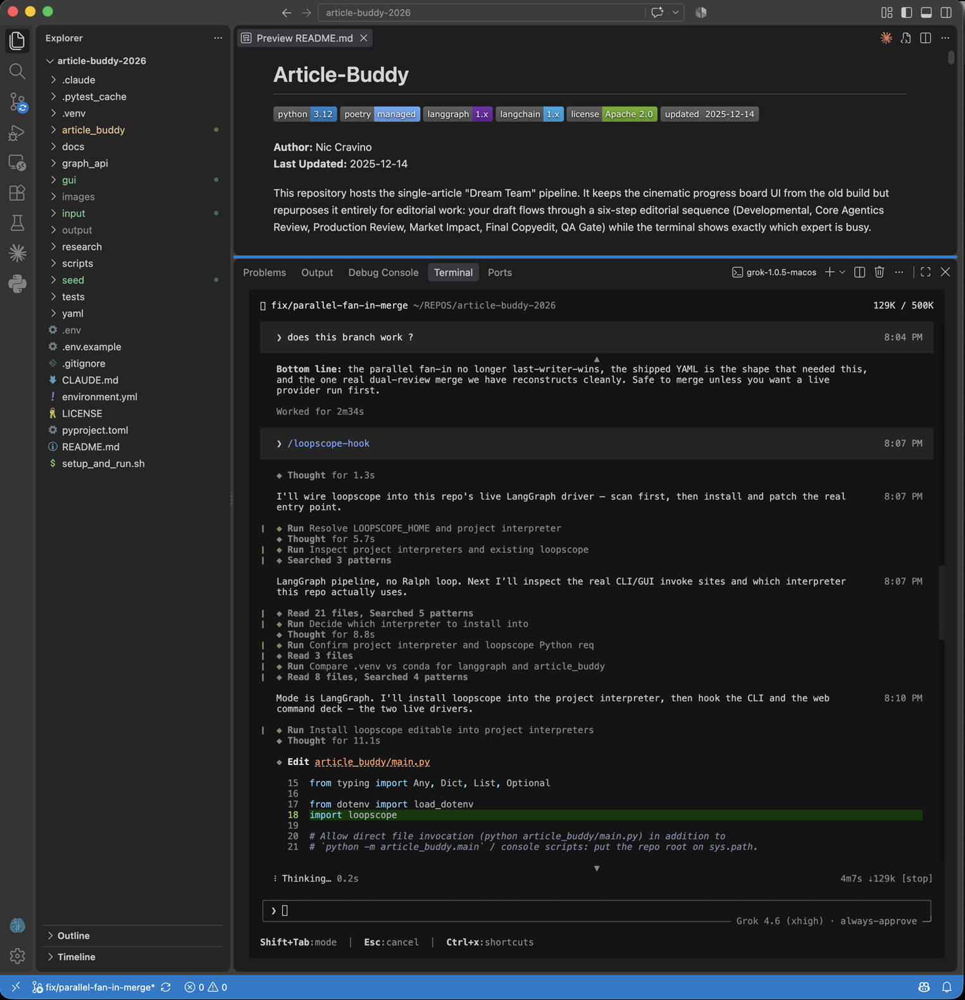

# Hook loopscope into a LangGraph project you already have

In VS Code or Grok, from **that** project, run `/loopscope-hook`. The skill is
self-contained (`skills/loopscope-hook/SKILL.md`) and patches the live entry
point. This page is the same recipe for doing it by hand.



You do not rewrite the graph. You do not add a database. You start a small
local dashboard, pass one extra `config` into `invoke`, and close the run when
the job is done.

The graph keeps doing what it does. loopscope only watches.

## 1. Install it into *your* venv

Same environment that already runs LangGraph. Python 3.10 or newer.

```bash
pip install -e /path/to/loopscope
```

You already have LangGraph, so you do not need loopscope's `langgraph` extra.

Check:

```python
import loopscope
print(loopscope.__version__)
```

## 2. The hook

**Before**

```python
app = graph.compile()
result = app.invoke(state)
```

**After**

```python
import loopscope

app = graph.compile()  # unchanged

scope = loopscope.start(open_browser=True)  # http://localhost:7788

config = loopscope.attach(app)
status = "error"
try:
    result = app.invoke(state, config=config)
    status = "ok"
finally:
    loopscope.finish(config, status=status)
```

Three rules:

1. Call `start()` **once** when the process boots, **before** any invoke.
2. Pass the dict that `attach()` returns as `config=`. If you forget, the graph
   still runs and the dashboard stays empty.
3. Call `finish(config)` when that job is done. If you forget, the dashboard
   keeps saying the run is live.

`attach()` works with `.invoke()`, `.ainvoke()`, `.stream()`, and `.astream()`.
You do not have to change which one you use.

## 3. You already pass a config

Keep it. `attach()` copies what you give it and appends its own handler.
Thread ids, checkpointers, your callbacks — they stay.

```python
config = loopscope.attach(
    app,
    config={
        "configurable": {"thread_id": "job-17"},
        "callbacks": [my_handler],
    },
    title="support bot",
)
result = app.invoke(state, config=config)
```

## 4. Script vs long-running server

`start()` returns at once. The dashboard runs on a background thread.

- **CLI, notebook, one-shot job.** The process would exit and take the
  dashboard with it. After the run, keep the process alive:

  ```python
  scope.hold()   # Ctrl-C to quit
  ```

- **A server that already stays up.** Call `start()` at boot. Do **not** call
  `hold()`. Call `attach()` / `finish()` around each job.

Do not call `start()` on every request. Port 7788 can only bind once.

## 5. Async and streams

Same pattern.

```python
scope = loopscope.start(open_browser=True)
config = loopscope.attach(app)
status = "error"
try:
    result = await app.ainvoke(state, config=config)
    status = "ok"
finally:
    loopscope.finish(config, status=status)
```

```python
config = loopscope.attach(app)
status = "error"
try:
    async for event in app.astream(state, config=config):
        ...
    status = "ok"
finally:
    loopscope.finish(config, status=status)
```

## 6. One job, many invokes

A `while` loop or a retry around `invoke` is **one run** if you attach once
and finish once. Each top-level invoke is one pass on the dashboard.

```python
config = loopscope.attach(app, title="draft until it scores")
status = "error"
try:
    while not good_enough(state):
        state = app.invoke(state, config=config)
    status = "ok"
finally:
    loopscope.finish(config, status=status)
```

Do not `finish()` between retries. The dashboard will think the job ended.

A new job (new user, new thread, new night) gets a new `attach()`. That starts
a new run.

## 7. Names on the mesh

The mesh is the node picture on the left. Subtitles come from the **first line**
of each node function's docstring.

```python
def retrieve(state):
    """search the doc store"""
    ...
```

Or set them by hand:

```python
loopscope.attach(app, roles={"retrieve": "search the doc store"})
```

Use a **compiled** app (`graph.compile()`). LangGraph tags those node runs.
A plain LangChain chain will not light up the mesh.

## 8. Optional: an outer Ralph loop

If something *outside* the graph keeps calling it until a number gets better,
wrap that outer loop. Graph nodes on the left, passes as columns.

```python
scope = loopscope.start(open_browser=True)
loop = loopscope.RalphLoop("draft until it scores", max_iters=8, stall_after=4)
config = loop.attach_graph(app)

for it in loop:
    state = app.invoke(state, config=config)
    it.signal(1 - state["score"], name="distance to 1.0")
    if state["score"] >= 0.9:
        it.done("good enough")
        break

scope.hold()
```

`it.done()` sets a flag. `break` if you want out of the `for` right away.
Do not call `loopscope.finish()` here — the Ralph loop closes the run itself.

## 9. Record a run

```python
loopscope.start(jsonl="runs/tonight.jsonl", open_browser=True)
```

Play it later:

```bash
python -m loopscope.replay runs/tonight.jsonl --speed 8
```

## 10. Extra lines from your own code

Works from inside a node, or from the driver:

```python
loopscope.log("retriever returned 0 hits", level="warn")
loopscope.metric("open_todos", 14)
```

## Did it work?

1. Browser opens at http://localhost:7788
2. The mesh shows **your** node names
3. The live feed ticks as nodes run
4. After `finish()`, it is not stuck on "still running"

Empty page + a graph that clearly ran = you invoked without the `config` that
`attach()` returned.

## Snags

| What you see | Likely cause |
|---|---|
| Empty dashboard | `invoke` without `config=` from `attach()` |
| Stays "still running" | forgot `finish()` |
| Tab opens, then dies | script exited; add `scope.hold()` |
| `could not bind` | something already on 7788 → `loopscope.start(port=7799)` |
| Import / `dataclass` error | Python 3.9; need 3.10+ |
| Nodes missing or doubled | not a compiled LangGraph app |

Default bind is `127.0.0.1:7788`. Leave it on loopback. There is no login.
Do not bind `0.0.0.0` unless you mean it.

State shown in the UI is truncated. Keys that look like secrets (`password`,
`api_key`, `token`, …) are redacted. This is a watch UI, not an audit log.

Turn state capture off if you do not want state in the browser at all:

```python
loopscope.attach(app, capture_state=False)
```

## See the hook once before you wire it

From the loopscope checkout:

```bash
./setup_and_run.sh --langgraph
```

That is the same `start` → `attach` → `invoke` → `finish` path, on a toy graph.
See `examples/langgraph_demo.py`.
