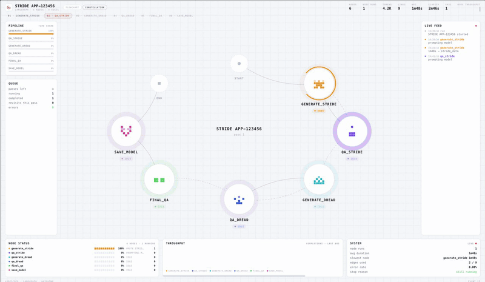
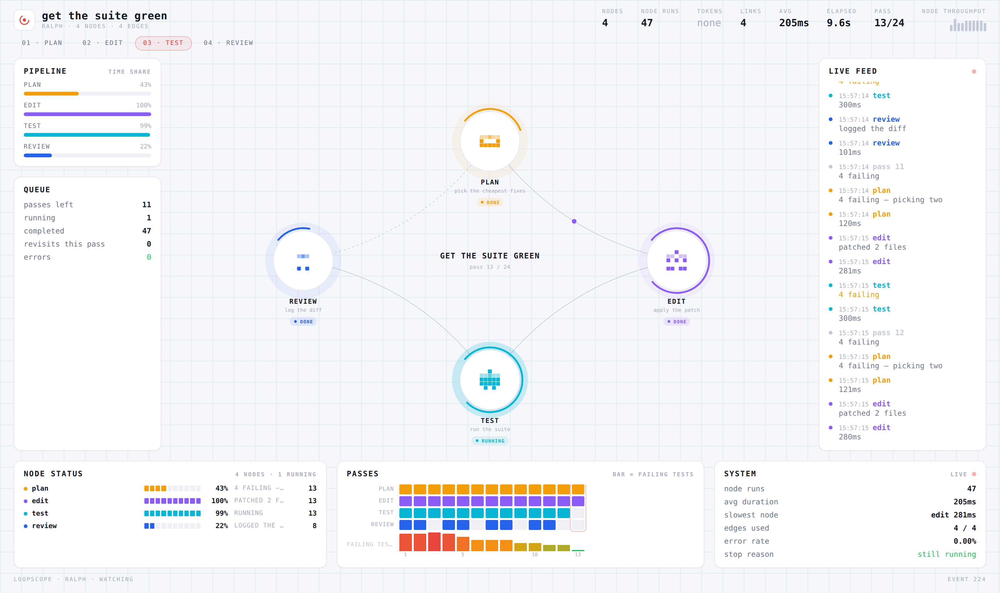
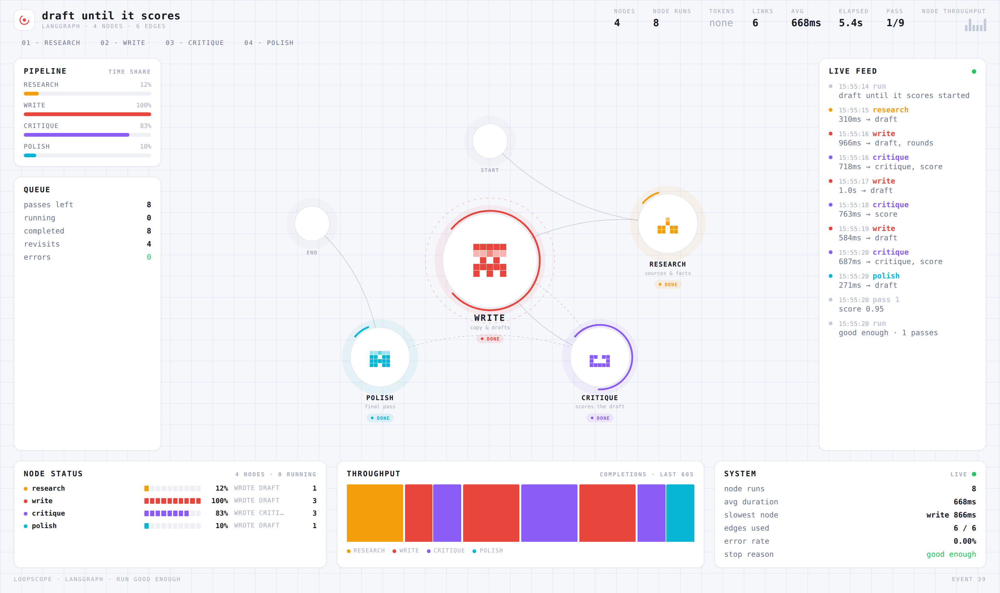

# loopscope



**0.1 Beta.** Live view of LangGraph state graphs and Ralph loops. One `pip install`, one line
of setup, no collector, no database, no accounts.



## Run it in 30 seconds

```bash
./setup_and_run.sh                 # venv + tests + Ralph demo → http://localhost:7788
./setup_and_run.sh --langgraph     # cyclic graph
./setup_and_run.sh --combo         # Ralph loop driving the graph
./setup_and_run.sh --help
```

Or by hand:

```bash
cd loopscope
python -m venv .venv && source .venv/bin/activate      # Windows: .venv\Scripts\activate
pip install -r requirements.txt
python examples/ralph_demo.py                          # → http://localhost:7788
```

That example needs nothing but the three packages above. For the LangGraph one:

```bash
pip install langgraph
python examples/langgraph_demo.py          # one graph run
python examples/langgraph_demo.py ralph    # a Ralph loop driving the graph
```



Installing the package itself is optional — the examples add the repo root to
`sys.path` when run from here. To use it in your own project:

```bash
pip install -e .
```

## What it shows

**The mesh** — your nodes as a constellation. The busiest node (a supervisor,
an orchestrator, whatever everything routes through) becomes the hub; the rest
orbit it. A plain cycle has no such node, so a Ralph loop puts its objective and
pass counter in the middle instead. Each node carries a ring showing its share
of the run's time, a status pill, and a subtitle taken from its docstring. When
control moves, a dot rides the link it moved along.

**Stage stepper** — the graph's layers as numbered stages, with the one
currently executing lit.

**Pipeline / Queue** — where the run is spending its time, passes remaining,
revisits inside the current pass, errors.

**Passes** — one column per pass, one row per node. Skipped nodes leave gaps,
revisits show a count, and the bar under each column is your convergence
signal, coloured red at the worst value seen and green at zero. Twenty passes
read as a fabric: convergence is a staircase, thrashing is noise. Single-pass
runs get a throughput chart here instead.

**Live feed** — timestamped node, tool and model lines, colour-coded per node.

**System** — node runs, average and slowest, edges exercised, error rate, and
why the run stopped.

## LangGraph

Hooking this into a graph you already have: [QUICKSTART-INTEGRATION.md](QUICKSTART-INTEGRATION.md).
In VS Code / Grok, from that project: `/loopscope-hook`.

```python
import loopscope

scope = loopscope.start(open_browser=True)

config = loopscope.attach(app)          # returns a LangChain config
try:
    app.invoke(state, config=config)    # .ainvoke / .stream / .astream all work
    loopscope.finish(config)
except Exception:
    loopscope.finish(config, status="error")
    raise

scope.hold()                            # keep the dashboard up after the script ends
```

`attach()` publishes the topology and appends a callback handler to whatever
config you pass in. Each top-level invocation counts as one pass, so a plain
`while` loop around `app.invoke()` already fills the tape.

## Ralph loops

```python
loop = loopscope.RalphLoop("get the suite green",
                           phases=["plan", "edit", "test", "review"],
                           max_iters=20, stall_after=5,
                           roles={"test": "run the suite"})   # subtitles

for it in loop:
    with it.phase("plan") as p:
        p.log("picking the two cheapest failures")
    with it.phase("edit"):
        apply_patch()
    with it.phase("test") as p:
        failures = run_tests()
        p.log(f"{failures} failing")

    it.signal(failures, name="failing tests")   # the number to drive to zero
    it.note(f"{failures} failing")

    if failures == 0:
        it.done("suite green")
```

`it.done()` sets a flag rather than raising — an exception thrown in a `for`
body never reaches the generator that yielded it, so raising would skip the
loop's own bookkeeping. The rest of the pass still runs; `break` right after if
you want out immediately.

The loop stops on `done()`, `max_iters`, `max_seconds`, or **stall**: when
`signal` has not improved for `stall_after` passes it says so and quits, which
is the failure mode a Ralph loop actually has.

Decorator form:

```python
@loopscope.ralph("keep fixing the build", phases=["edit", "test"])
def one_pass(it):
    ...
    return failures        # falsy return converges the loop
```

## Both at once

A Ralph loop outside, a graph inside, one timeline — graph nodes on the left,
Ralph passes on the tape:

```python
loop = loopscope.RalphLoop("draft until it scores")
config = loop.attach_graph(app)

for it in loop:
    state = app.invoke(state, config=config)
    it.signal(1 - state["score"], name="distance to 1.0")
    if state["score"] >= 0.9:
        it.done("good enough")
```

## Recording and replay

```python
loopscope.start(jsonl="runs/tonight.jsonl")
```

```
python -m loopscope.replay runs/tonight.jsonl --speed 8
```

Overnight loops finish while you are asleep; the replay plays back at whatever
speed you can stand.

## Anything else

Any loop at all can push to the same dashboard:

```python
loopscope.log("compaction finished", level="warn")
loopscope.metric("open_todos", 14)
```

## How it fits together

```
your code ──► EventBus ──► websocket ──► dashboard
              (ring buffer, thread-safe, optional JSONL)
```

- The server runs on its own thread with its own event loop, so `start()`
  returns immediately and publishing is safe from any thread — sync `.invoke()`
  on the main thread, an async app on its own loop, a worker pool.
- The ring buffer (4000 events; topology is pinned and never evicted) is
  replayed to every new browser. Opening the tab halfway through a run still
  draws the graph and recent history. Overnight loops that wrap the buffer lose
  early log lines — pass `jsonl=` if you need the full tape.
- Layout (layering, cycle-breaking, hub detection, orbit placement, colour
  assignment) is computed in Python; the browser draws coordinates and stretches
  the orbit to whatever aspect the pane has.
- `raise_error = False` on the handler and swallowed exceptions in `publish()`:
  a broken dashboard must never take down the run it is watching.

## Files

```
README.md
QUICKSTART-INTEGRATION.md   drop-in hook for an existing LangGraph app
skills/loopscope-hook/      VS Code / Grok skill: wire it from another repo
setup_and_run.sh      venv, tests, demo dashboard
pyproject.toml
requirements.txt
LICENSE
docs/                 dashboard GIF and screenshots
loopscope/
  events.py     event vocabulary, state summarising, truncation
  bus.py        thread-safe pub/sub with replay buffer
  layout.py     cycle-aware layering + radial mesh placement
  topology.py   packs nodes, edges, colours, stages into one event
  server.py     FastAPI + websocket + background thread
  langgraph.py  topology extraction + callback handler
  ralph.py      iteration protocol, phases, stall detection
  replay.py     JSONL playback
  static/dashboard.html
examples/
  ralph_demo.py       Ralph loop, no LangGraph needed
  langgraph_demo.py   cyclic graph; `ralph` argument for the combo
```

## Ports

Everything defaults to `127.0.0.1:7788`. Change it with `loopscope.start(port=...)`
if something else already has it.

## Notes and limits

- Node subtitles come from the first line of each node function's docstring,
  or from `roles={"node": "text"}` if you would rather say it explicitly.
- Node identity comes from `metadata["langgraph_node"]`, filtered to runs tagged
  `graph:step:N`. Without that filter, routers and chains inside a node
  double-count as node executions.
- Edge traversal is inferred from execution order, which is exact for
  sequential graphs and approximate under parallel fan-out.
- State deltas are truncated for the wire (600 chars, 40 keys, 12 list items).
  Obvious secret-shaped keys are redacted. The dashboard is for watching, not
  for auditing.
- Python 3.10 or newer.
- Bind to `127.0.0.1` unless you mean it; there is no auth. Binding `0.0.0.0`
  prints a warning. The websocket accepts same-origin browsers and loopback
  clients only.

## License

Apache-2.0. See [LICENSE](LICENSE).
